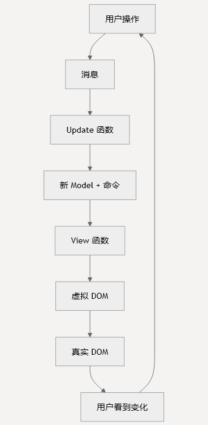

# 安装和设置
- 读者：杨智炜
- 时间：2025年12月4日
---
- 安装 Rabbit-TEA 并使用 TEA
- 构建第一个功能性 Web 应用程序
## 前置条件
- MoonBit CLI
- Node.js
- 浏览器
## 安装方法
- 法1：使用 Rabbit-TEA 模板
    - 拉取模板代码库
    - 阅读代码库readme文件
- 法2：手动设置
    - 创建MoonBit项目
    - 添加Rabbit-TEA依赖并跟新导入
## 项目结构
典型的项目结构
```
my-rabbit-tea-app/
├── src/
│   ├── top.mbt              # 应用程序入口点
│   ├── model.mbt            # 状态管理
│   ├── update.mbt           # 更新逻辑
│   ├── view.mbt             # 视图渲染
│   └── messages.mbt         # 消息类型
├── moon.pkg.json            # 包配置
├── index.html               # HTML 模板
└── package.json             # Node.js 依赖
```
## 核心架构设置
- 遵循 TEA 模式，包含核心三组件
1. Model
2. Messages
3. Update 函数
4. View 函数
## 应用程序启动
- main 函数
```mbt
fn main {
  @tea.startup(model~, update~, view~)
}
```
- 需要 URL 路由的，改用 application 函数
```mbt
fn main {
  @tea.application(
    initialize~ = init_from_url,
    update~ = update,
    view~ = view,
    url_changed~ = UrlChanged,
    url_request~ = UrlRequest
  )
}    
```
## HTML 模板设置
创建index.html作为应用程序挂载点
## 构建和运行
- 开发模式
```sh
# 构建项目
moon build
 
# 启动开发服务器
moon run
```
- 生产构建
```sh
# 构建生产版本
moon build --release
 
# 生成的 JavaScript 将位于 target/main.js
```
## 配置选项
- JavaScript 输出格式
包配置中配置 JavaScript 输出格式：
```json
{
  "link": {
    "js": {
      "format": "iife"
    }
  }
}
```
- 自定义挂载点
```mbt
@tea.startup(
  model~, update~, view~,
  mount? = "my-custom-app"
)    
```
## 故障排除
- 常见问题
1. 构建失败并出现导入错误：确保所有 Rabbit-TEA 包已正确添加到 moon.pkg.json
2. 应用程序不渲染：检查你的 HTML 文件是否具有正确的挂载点 div
3. View 函数中的类型错误：验证你的消息类型在 view 和 update 函数之间是否匹配
## 获取帮助
- 查看 [Rabbit-TEA 示例仓库](https://github.com/evinyang-zw/rabbit-tea-examples.git)获取示例应用程序
## 后续步骤
基本应用程序结构遵循以下流程：



>这种循环模式确保了`可预测的状态管理`和 Web 应用程序中`清晰的关注点分离`。