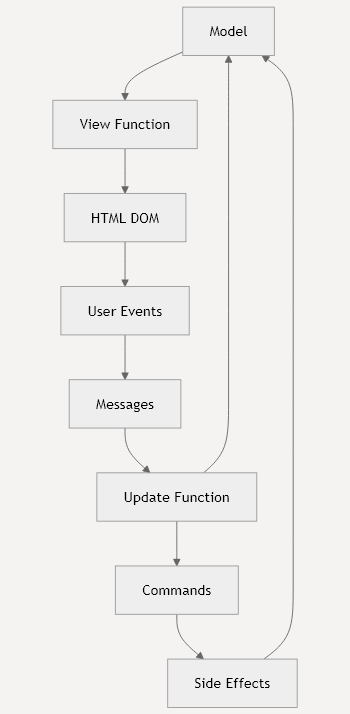

# 快速入门
- TEA（The Elm Architecture）模式构建声明式 Web 应用程序
- 函数式的 Web 开发方法，具有类型安全、模式匹配和轻量级运行时的特性
---
# TEA 架构概述
- Model-View-Update (MVU) 架构模式


- 单向数据流——数据始终在一个方向上流动
- 可预测且更易于调试
---
# 你的第一个 Rabbit-TEA 应用程序
- 创建一个简单的计数器应用程序
## 步骤 1：定义你的 Model 和 Messages
## 步骤 2：实现 Update 函数
```mbt
fn update(msg : Msg, model : Model) -> (Cmd[Msg], Model) {
  match msg {
    Increment => (none(), model + 1)
    Decrement => (none(), model - 1)
  }
}    
```
## 步骤 3：创建 View 函数
```mbt
fn view(model : Model) -> Html[Msg] {
  div([
    h1([text(model.to_string())]),
    button(click=Increment, [text("+")]),
    button(click=Decrement, [text("-")]),
  ])
}    
```
## 步骤 4：启动应用程序
```mbt test
fn main {
  @tea.startup(model~, update~, view~)
}
// @tea.startup 函数会自动将你的应用程序挂载到 id 为 "app" 的 HTML 元素上。
// 你可以通过 mount? 参数自定义这个设置。
```
---
# 核心概念详解
## Model
## Messages
## Update 函数
- update 函数是纯函数
- 给定消息和当前 model
- 返回新的 model 状态和可选命令
- 命令代表副作用，如 HTTP 请求或导航
## View 函数
## Commands
- Commands 代表异步操作和副作用
    - none() - 无操作
    - task(msg) - 触发另一个更新
    - batch(cmds) - 执行多个命令
    - perform(msg, async_fn) - 运行异步操作
---
# HTML 和事件处理
- Rabbit-TEA 提供HTML 元素和事件处理器集合
## 常见 HTML 元素
```mbt
// 基本元素
div([class="container"], [text("Hello")])
h1([text("Title")])
p([text("Paragraph")])
button(click=MyMsg, [text("Click me")])
```
## 事件处理
```mbt
// 点击事件
button(on_click(mouse => MyClickedMsg(mouse.offset_pos())), [text("Click")])
 
// 输入事件
input(on_input(value => InputChanged(value)))
 
// 变更事件
select(on_change(value => SelectionChanged(value)), [options])    
```
## 样式和属性
```mbt test
div([
  style("color", "blue"),
  style("font-size", "16px"),
  attribute("data-id", "123"),
  class("my-class"),
  id("my-id")
], [content])   
```
---
# 项目结构
```
my-app/
├── moon.pkg.json          ├── main.mbt              # 主应用程序入口
├── model.mbt             # 应用程序状态和消息
├── update.mbt            # 更新逻辑
├── view.mbt              # 视图函数
└── index.html            # HTML 入口
```
---
# 后续步骤
- [安装和设置](安装和设置.md) → 学习如何设置你的开发环境